# Отчёт по домашней работе №3

## Описание
В результате выполнения ДЗ требуется настроить разные виды репликации, протестировать их влияние на производительность системы.

Описание ДЗ:
  
Выбираем 2 запроса на чтение (/user/get/{id} и /user/search)

1. Используем одну ноду базы данных
2. Используем схему с одним мастером и двумя слейвами
3. Используем высокодоступное решение на базе patroni 

В приложении реализована возмонжость указания подключения для записи и для чтения

| Переменная | Значение по умолчанию | Описание |
|------------|----------------------|-----------|
| WRITE_DB_HOST | db | Хост для записи в базу данных |
| WRITE_DB_PORT | 5432 | Порт для записи в базу данных |
| WRITE_DB_NAME | root | Имя базы данных для записи |
| WRITE_DB_USER | root | Пользователь для записи в базу данных |
| WRITE_DB_PASSWORD | password | Пароль для записи в базу данных |
| READ_DB_HOST | db | Хост для чтения из базы данных |
| READ_DB_PORT | 5432 | Порт для чтения из базы данных |
| READ_DB_NAME | root | Имя базы данных для чтения |
| READ_DB_USER | root | Пользователь для чтения из базы данных |
| READ_DB_PASSWORD | password | Пароль для чтения из базы данных |

## Результаты работы на одной ноде Postgresql

С помощью инструмента JMeter проводилось нагрузочное тестрование и вот его результаты:

Список запросов и время ответов
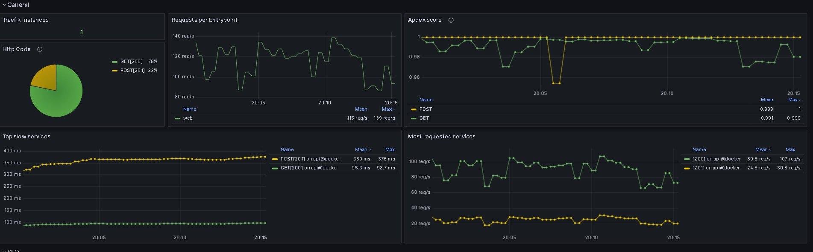

Нагрузка на сервисы api, db
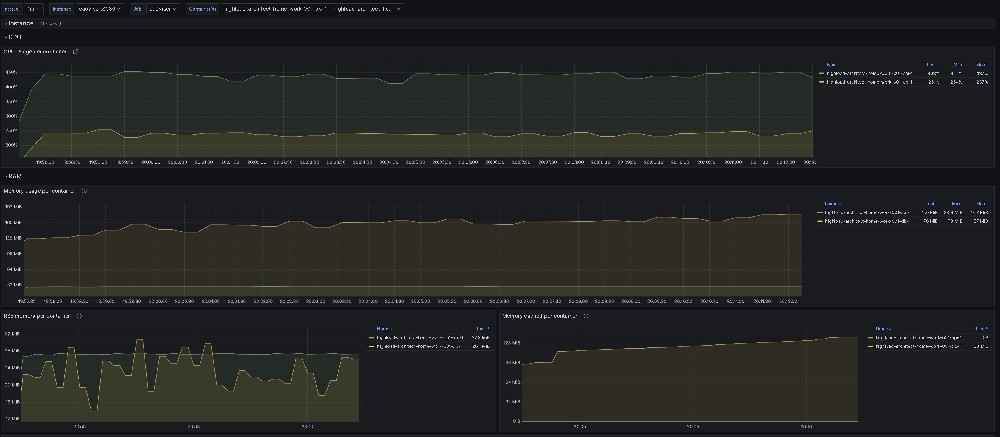
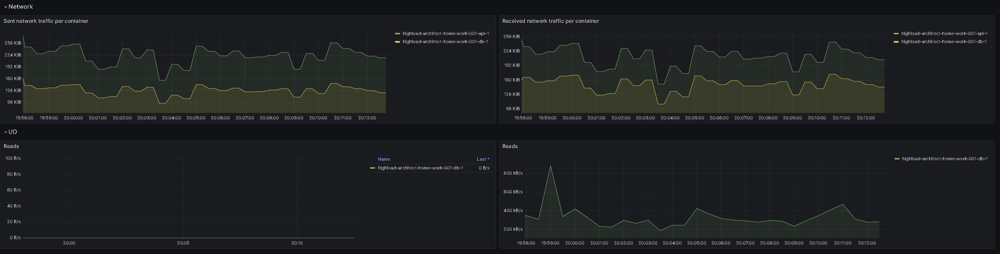

Метрики Postgresql
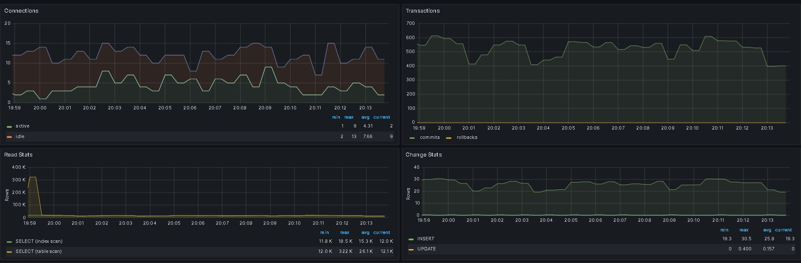
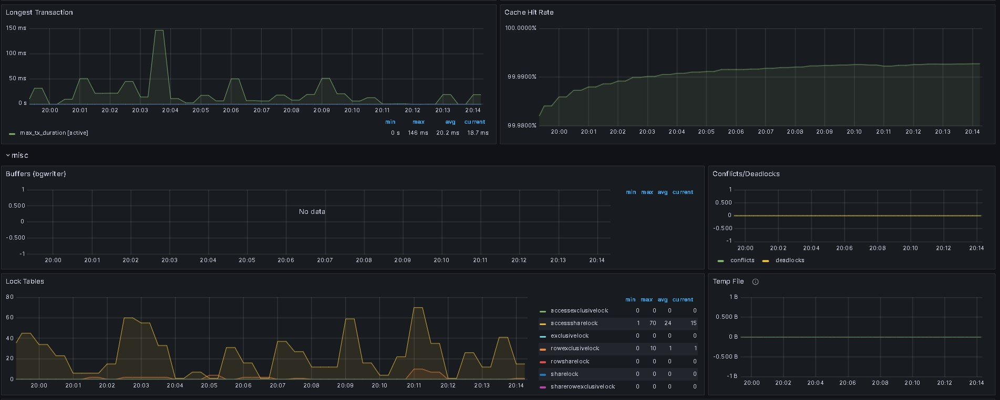
 
## Результаты работы на кластерной структуре Postgresql (один master, два slave)

С помощью инструмента JMeter проводилось нагрузочное тестрование и вот его результаты:

Нагрузка на сервисы api, db
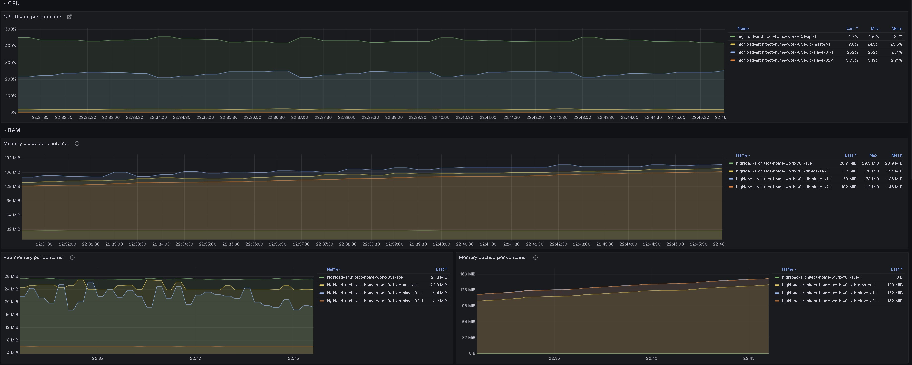
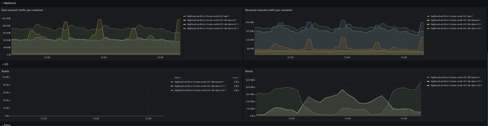

Метрики Postgresql
DB Master
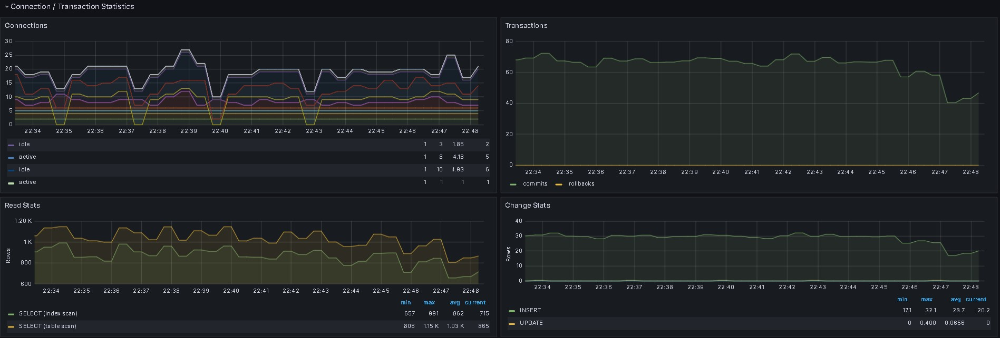

DB Slave 01
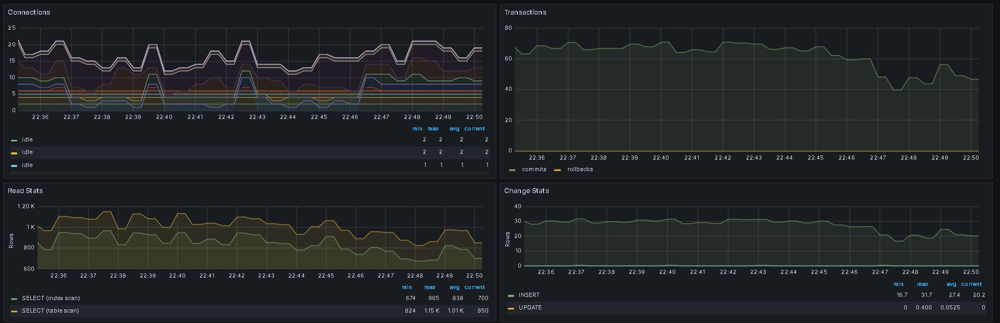
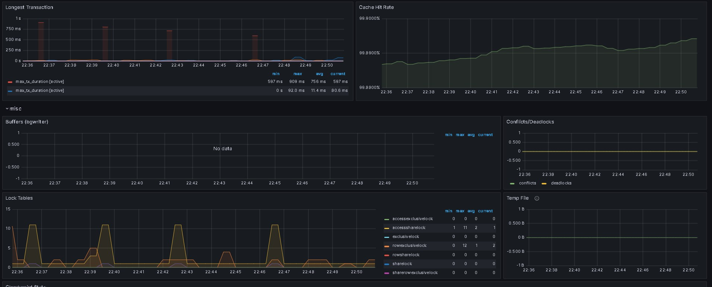

DB Slave 02
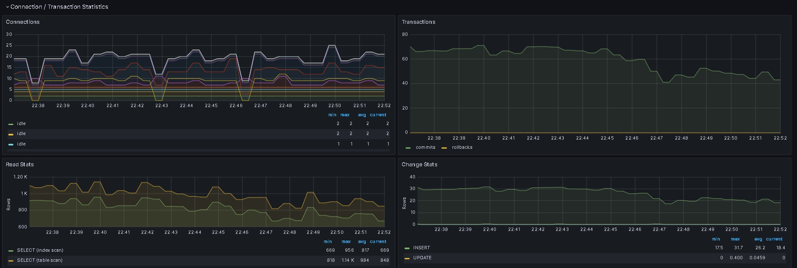
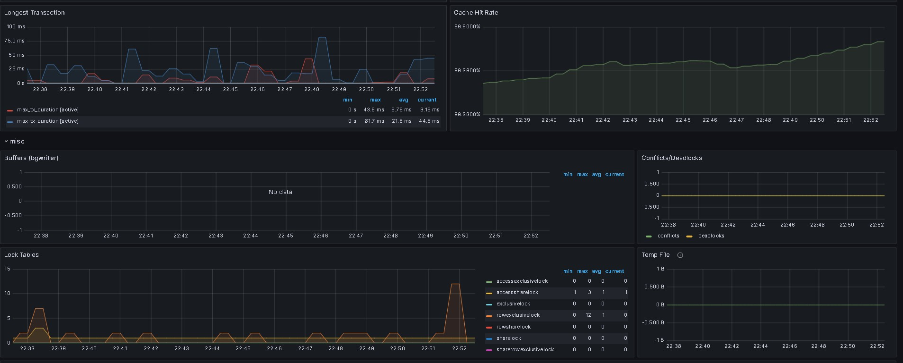

Время обработки запросов JMeter
Вставка данных
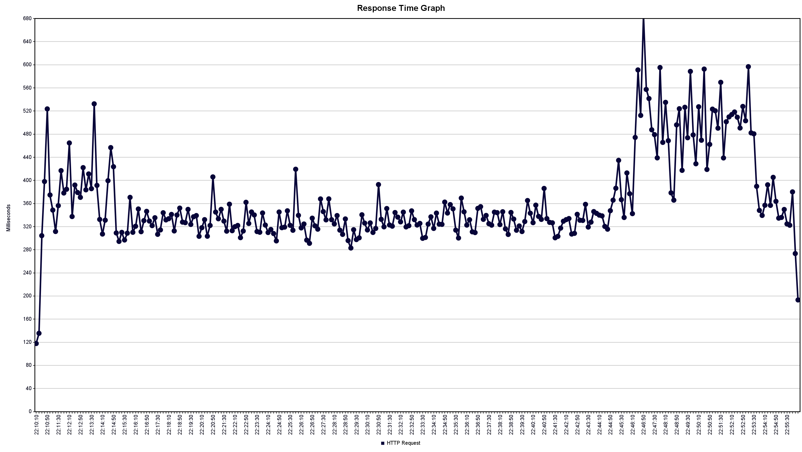
Чтение данных
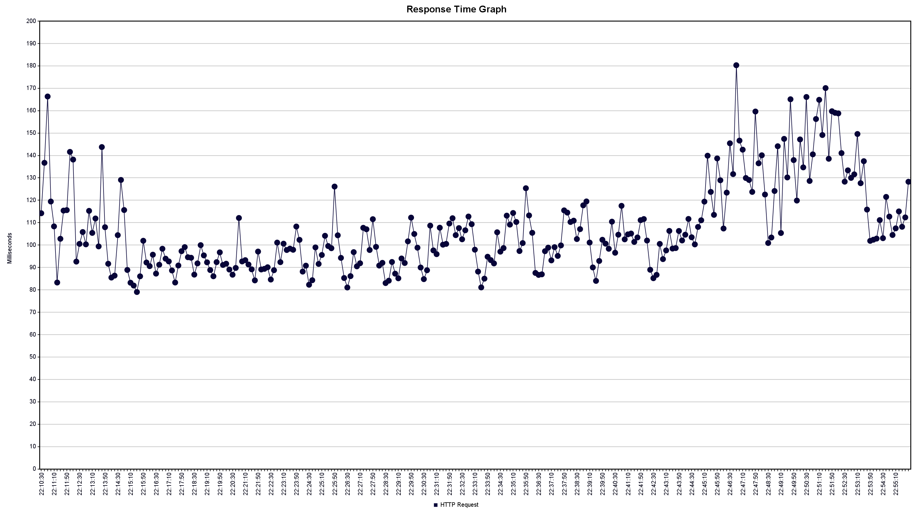

## Результаты работы на кластере Postgresql высокой доступности

С помощью инструмента JMeter проводилось нагрузочное тестрование и вот его результаты:

Список запросов и время ответов
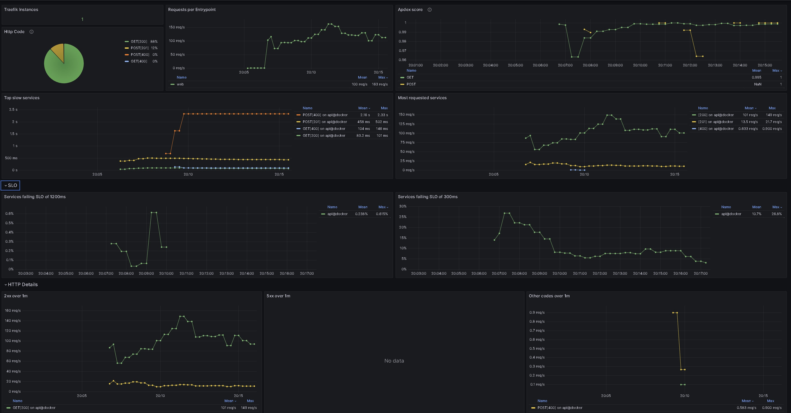

Так же проводилось отключение текущей мастер ноды. 
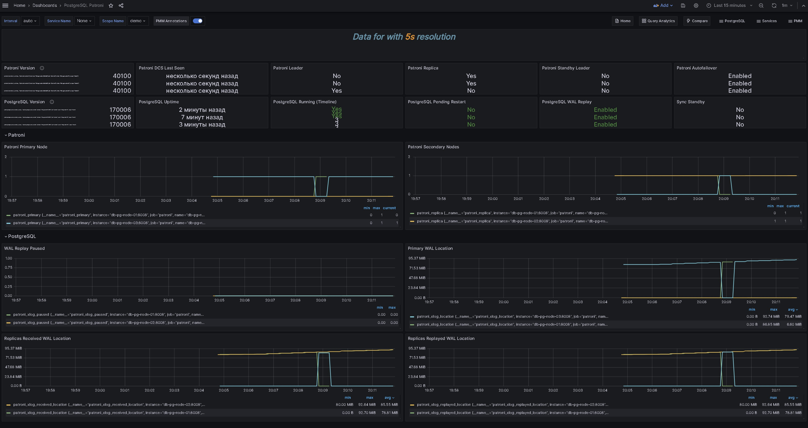

Метрики Postgresql
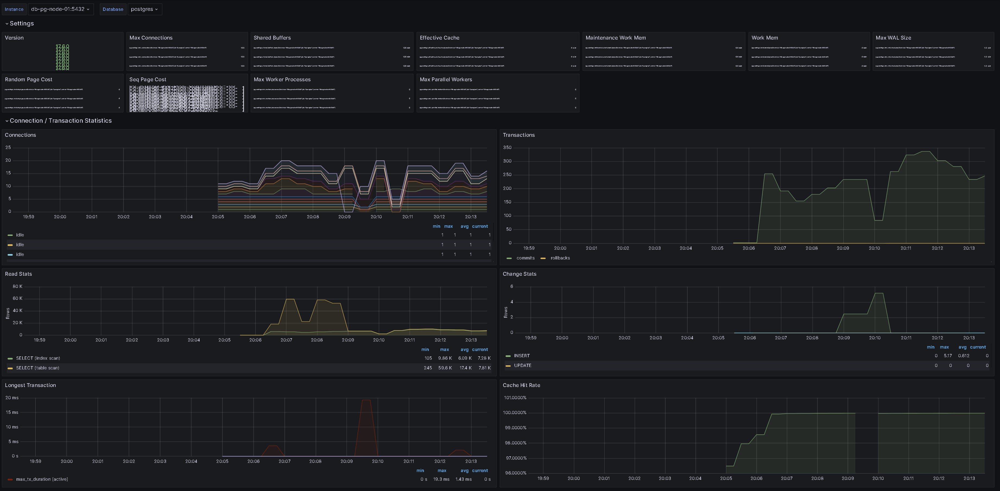
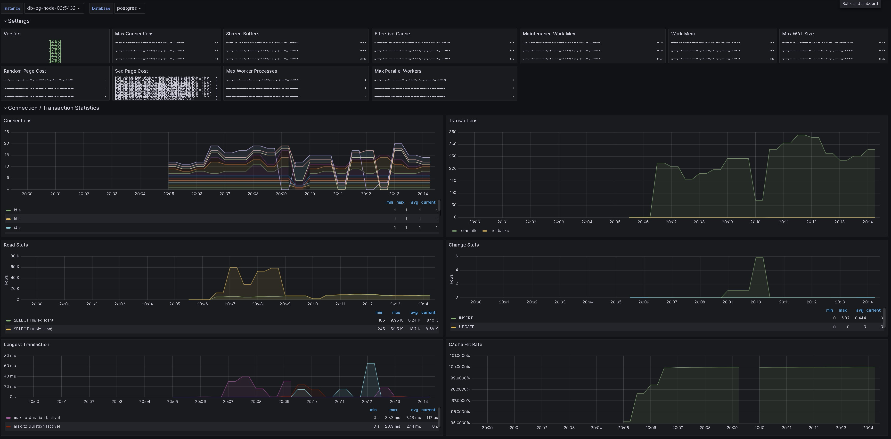
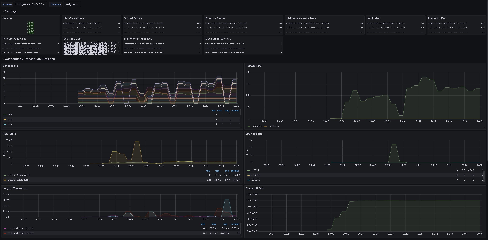

Время обработки запросов JMeter
В результате отключения мастер ноды у нескольких запросов на запись увеличилось время отжидания ответа, но у запросов по чтению данных подобного не наблюдается
Метрики Patroni
Вставка данных
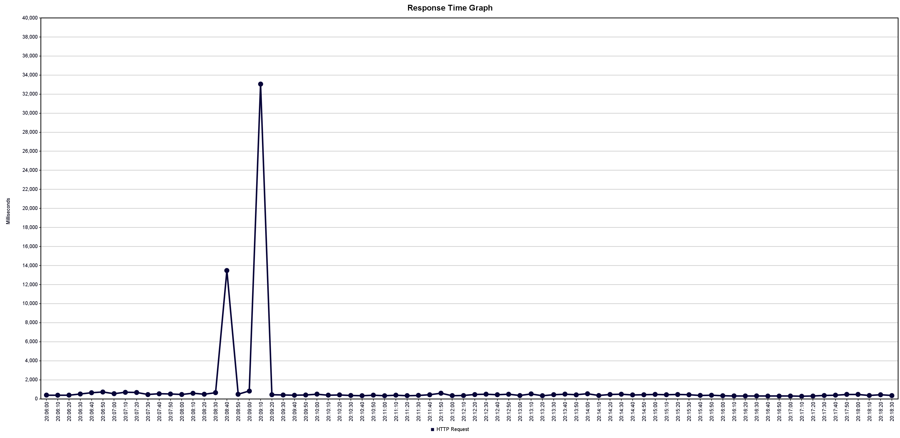
Чтение данных
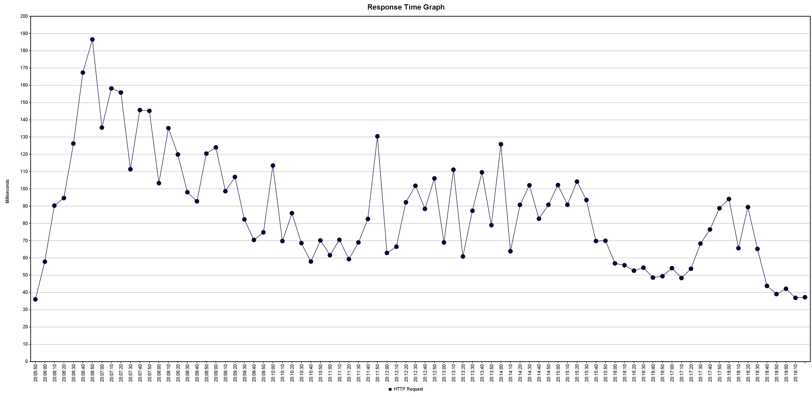
