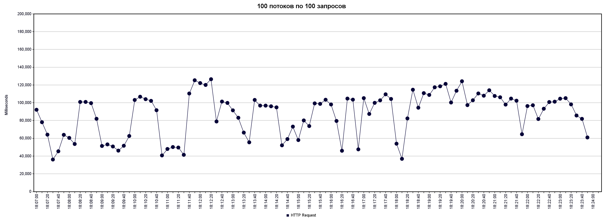
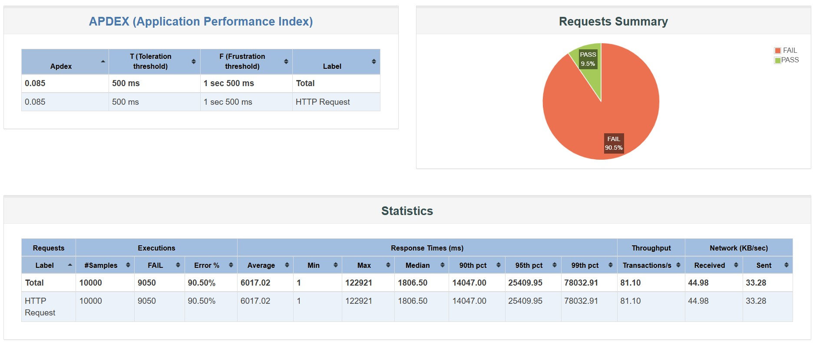
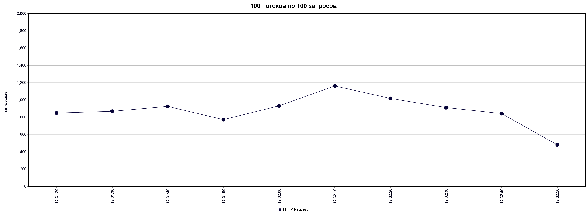
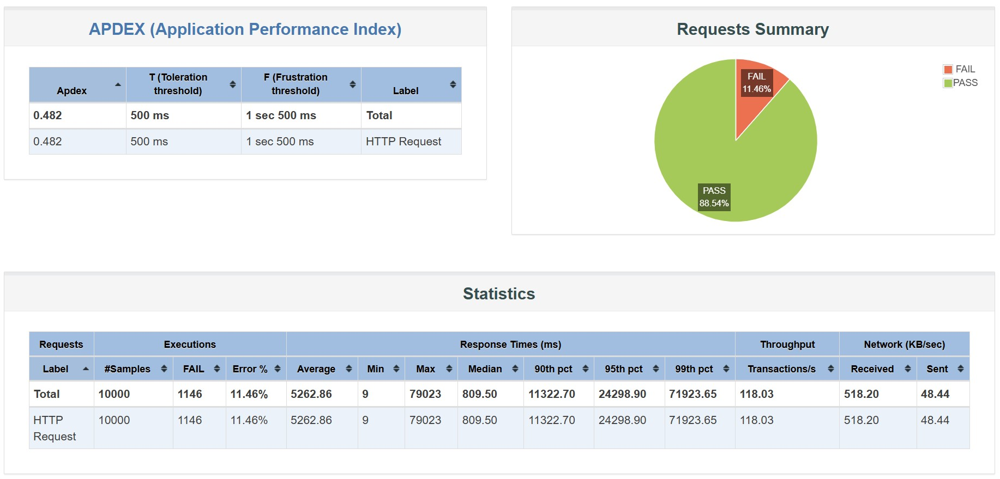
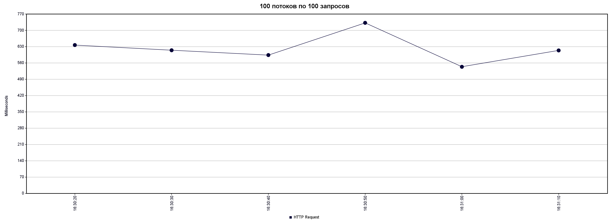
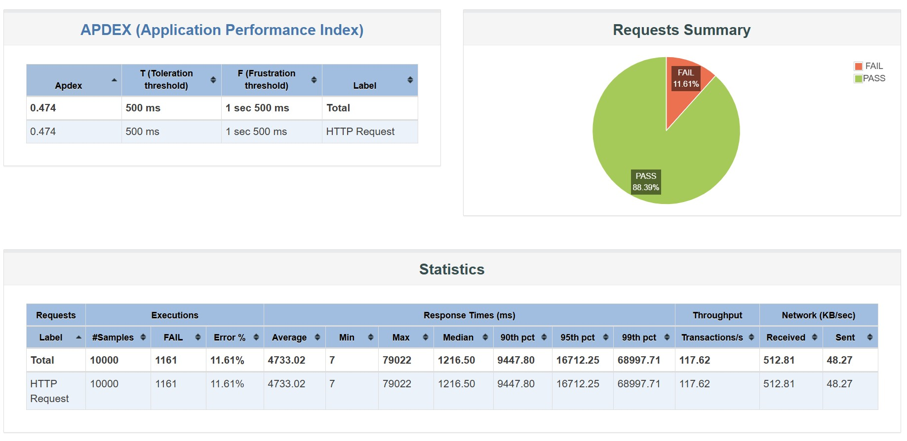

# До добавления индексов
## План запроса
```
QUERY PLAN                                                                                              
----------
Sort  (cost=35443.68..35443.69 rows=1 width=119)
  Sort Key: id
  ->  Gather  (cost=1000.00..35443.67 rows=1 width=119)
        Workers Planned: 2
        ->  Parallel Seq Scan on users  (cost=0.00..34443.57 rows=1 width=119)
              Filter: (((first_name)::text ~~* '%Абр%'::text) AND ((last_name)::text ~~* '%Ант%'::text))
```
## Нагрузочное тестирование
### Результаты 100 потоков по 100 запросов

### Результаты 1000 потоков по 10 запросов

# После добавления двух отдельных индексов
## Добавление индексов
```SQL
-- Включите расширение для триграммного поиска
CREATE EXTENSION IF NOT EXISTS pg_trgm
-- Создание индексов для оптимизации поиска
CREATE INDEX IF NOT EXISTS idx_users_first_name ON users USING gin (first_name gin_trgm_ops);
CREATE INDEX IF NOT EXISTS idx_users_last_name ON users USING gin (last_name gin_trgm_ops);
```
## План запроса
```
QUERY PLAN                                                                                              
----------
Sort  (cost=131.75..131.76 rows=1 width=119)
  Sort Key: id
  ->  Bitmap Heap Scan on users  (cost=127.73..131.74 rows=1 width=119)
        Recheck Cond: (((first_name)::text ~~* '%Абр%'::text) AND ((last_name)::text ~~* '%Ант%'::text))
        ->  BitmapAnd  (cost=127.73..127.73 rows=1 width=0)
              ->  Bitmap Index Scan on idx_users_first_name  (cost=0.00..16.47 rows=63 width=0)
                    Index Cond: ((first_name)::text ~~* '%Абр%'::text)
              ->  Bitmap Index Scan on idx_users_last_name  (cost=0.00..111.01 rows=11601 width=0)
                    Index Cond: ((last_name)::text ~~* '%Ант%'::text)                            
```
## Размер индексов
```
schema|table_name|index_name              |size   |
------+----------+------------------------+-------+
public|users     |idx_users_last_name     |16 MB  |
public|users     |idx_users_first_name    |14 MB  |
```
## Нагрузочное тестирование
### Результаты 100 потоков по 100 запросов

### Результаты 1000 потоков по 10 запросов

# После добавления композитного индекса
## Добавление индекса
```SQL
-- Создание композитного индекса для оптимизации поиска
CREATE INDEX IF NOT EXISTS idx_users_first_last_gin 
ON users USING gin (first_name gin_trgm_ops, last_name gin_trgm_ops);
```
## План запроса
```
QUERY PLAN                                                                                                  
----------
Sort  (cost=36.03..36.04 rows=1 width=119)
  Sort Key: id
  ->  Bitmap Heap Scan on users  (cost=32.01..36.02 rows=1 width=119)
        Recheck Cond: (((first_name)::text ~~* '%Абр%'::text) AND ((last_name)::text ~~* '%Ант%'::text))
        ->  Bitmap Index Scan on idx_users_first_last_gin  (cost=0.00..32.01 rows=1 width=0)
              Index Cond: (((first_name)::text ~~* '%Абр%'::text) AND ((last_name)::text ~~* '%Ант%'::text))
```
## Размер индексов
```
schema|table_name|index_name              |size   |
------+----------+------------------------+-------+
public|users     |idx_users_first_last_gin|30 MB  |
```
## Нагрузочное тестирование
### Результаты 100 потоков по 100 запросов

### Результаты 1000 потоков по 10 запросов

# Выводы
Реализация индексации существенно оптимизировала работу системы: пропускная способность увеличилась, а latency запросов снизилась. Композитный индекс обеспечил наиболее значительный эффект, сократив стоимость выполнения поисковых операций на три порядка величины — с 35 078 до 36 cost units.

Индекс idx_users_first_last_gin оптимален для сценариев нечеткого поиска по комбинации полей. Бенчмарки показали его трехкратное превосходство над решением с раздельными индексами. Несмотря на то, что абсолютный выигрыш менее выражен, чем при переходе от sequential scan к indexed search, наблюдаемая ресурсная экономика оправдывает применение данного индекса для запросов, осуществляющих фильтрацию по обоим атрибутам одновременно