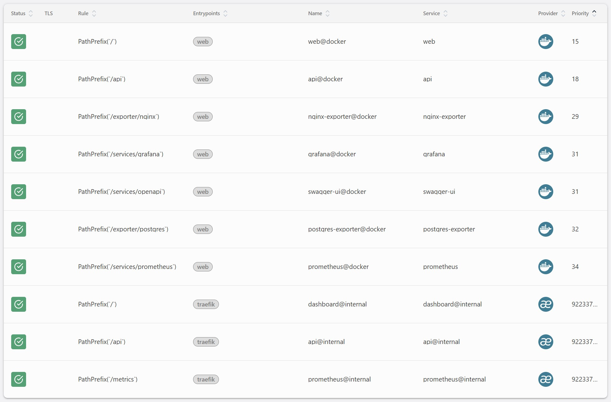
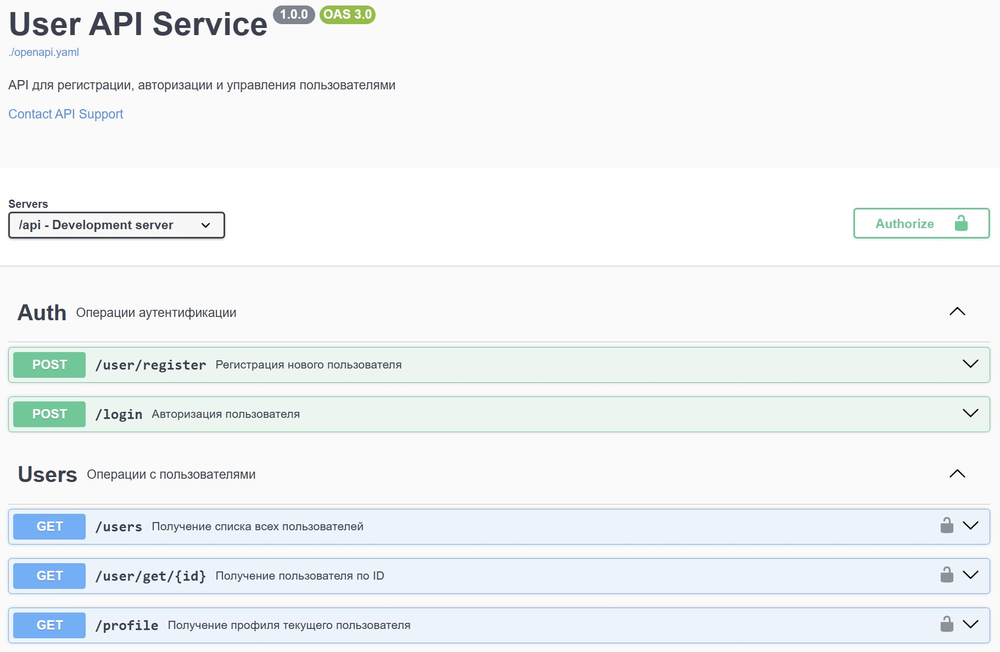

# Сервис для регистрации пользователей и просмотра их
## Запуск
### Docker
#### Запуск производится командой
```bash
docker compose up -d
```
#### Список доступных сервисов

| Путь | Сервис |
|---|---|
| http://localhost:8080/ | Traefik |
| http://localhost:8081/ | Fronend (react js) |
| http://localhost:8081/api/ | Backend (golang) |
| http://localhost:8081/services/prometheus/ | Prometheus |
| http://localhost:8081/exporter/nginx/ | Prometheus Nginx Exporter |
| http://localhost:8081/exporter/postgres/ | Prometheus Postgres Exporter |
| http://localhost:8081/services/grafana/ | Grafana |
| http://localhost:8081/services/openapi/ | Swagger |
#### Backend (golang)

##### Список переменных
Для указания параметров необходимо передать параметры, как переменные окружения
| Переменная | Значение по-умолчанию | Описание |
|---|---|---|
| SERVER_PORT | 8080 | Порт на котором запускается сервис |
| SERVER_PATH | /api/v1 | Путь по которому доступен сервер |
| CORS_ALLOWED_ORIGINS | http://localhost:3000,</br> http://localhost:8080,</br> http://localhost:5173,</br> http://127.0.0.1:3000,</br> http://127.0.0.1:8080,</br> http://localhost:8082 | Настройка одобренных доменов для CORS |
| SERVER_SWAGGER | disabled | Включение swagger на сервисе |
| WRITE_DB_HOST | localhost | имя хоста базы данных для записи |
| WRITE_DB_PORT | 5432 | порт хоста базы данных для записи |
| WRITE_DB_NAME | root | имя базы данных для записи  |
| WRITE_DB_USER | root | имя пользователя базы данных для записи |
| WRITE_DB_PASSWORD | password | пароль пользователя базы данных для записи |
| READ_DB_HOST | localhost | имя хоста базы данных для чтения |
| READ_DB_PORT | 5432 | порт хоста базы данных для чтения |
| READ_DB_NAME | root | имя базы данных для чтения  |
| READ_DB_USER | root | имя пользователя базы данных для чтения |
| READ_DB_PASSWORD | password | пароль пользователя базы данных для чтения |
##### Список путей
| Путь | Метод | Описание |
|---|---|---|
| /login | POST | Аутентификация пользователя  |
| /user/register | POST | Регистрация пользователя |
| /users | GET | Просмотр списка пользователей |
| /user/get/:id | GET | Просмотр профиля пользователя по конкретному ID |
| /profile | GET | Просмотр своего профиля |
| /health | GET | Просмотр состояния сервиса |
| /metrics | GET | Просмотр метрик Prometheus |
| /swagger/index.html | GET | инструмент Swagger |
##### Консольные команды
| Запуск | Результат |
|---|---|
| ./api | Запуск основного приложения |
| ./api healthcheck | Проверка состояния приложения |
#### Fronend (react js)
##### Список переменных
Для указания новых значение необходимо по пути /usr/share/nginx/html/config.json смонтировать файл формата
```json
{
  "API_BASE_URL": "http://localhost:8080/api/v1",
  "FRONTEND_BASE_URL": "http://localhost:3000"
}
```
| Переменная | Значение по-умолчанию | Описание |
|---|---|---|
| API_BASE_URL | http://localhost:8080/api/v1 | Доменное имя расположение Api |
| FRONTEND_BASE_URL | http://localhost:3000 |  Доменное имя сайта |
##### Список путей
| Путь | Описание |
|---|---|
| / | Основное приложение  |
| /health | Проверка доступности сервера |
| /nginx_status | Nginx метрики |
## Возможные ошибка
Возможно возникновение ошибки "*Error response from daemon: IPAM error: requested ip address 172.21.0.34 is already allocated to container ID 0e4968d*"
Для \того необходимо ввести *docker compose down* подождать немного и снова запустить docker compose -d up